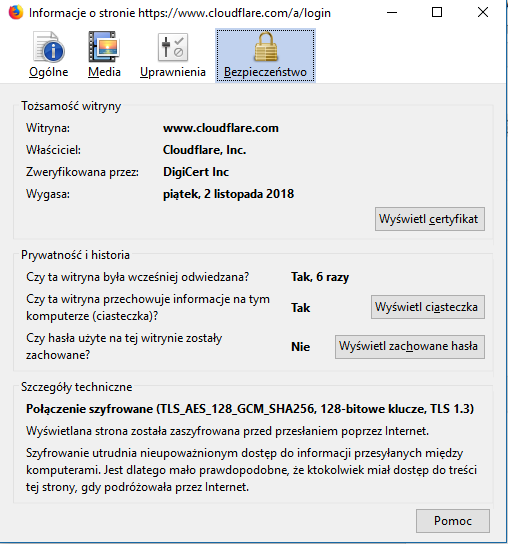

# awesome-doh

1.

[https://1.1.1.1/](https://1.1.1.1/)

Benchmark of dns providers:

https://medium.com/@nykolas.z/dns-resolvers-performance-compared-cloudflare-x-google-x-quad9-x-opendns-149e803734e5

2. DNSSEC vs DNS over HTTPs/TLS

https://developers.cloudflare.com/1.1.1.1/dns-over-https/

3. Windows

3.1 Download cloudflared service:

[https://developers.cloudflare.com/argo-tunnel/downloads/](https://developers.cloudflare.com/argo-tunnel/downloads/)

for Windows 32/64b:

[https://bin.equinox.io/c/VdrWdbjqyF/cloudflared-stable-windows-386.zip](https://bin.equinox.io/c/VdrWdbjqyF/cloudflared-stable-windows-386.zip)

[https://bin.equinox.io/c/VdrWdbjqyF/cloudflared-stable-windows-amd64.zip](https://bin.equinox.io/c/VdrWdbjqyF/cloudflared-stable-windows-amd64.zip)

and save at:

C:\cloudflared\cloudflared.exe

At the same location create following text file &quot;config.yaml&quot; with following content:

\_\_\_\_\_\_\_\_\_\_\_\_\_\_\_\_\_\_\_\_\_\_\_\_\_\_\_\_\_\_\_\_\_\_\_\_\_\_\_\_\_\_\_\_\_\_\_\_\_\_\_\_\_\_\_\_\_\_\_\_\_\_\_\_\_\_\_\_\_\_\_\_

proxy-dns: true

logfile: C:\cloudflared\logs.txt

proxy-dns-upstream:

 - https://1.1.1.1/dns-query

 - [https://1.0.0.1/dns-query](https://1.0.0.1/dns-query)

\_\_\_\_\_\_\_\_\_\_\_\_\_\_\_\_\_\_\_\_\_\_\_\_\_\_\_\_\_\_\_\_\_\_\_\_\_\_\_\_\_\_\_\_\_\_\_\_\_\_\_\_\_\_\_\_\_\_\_\_\_\_\_\_\_\_\_\_\_\_\_\_\_\_

Do not afraid it is an open-source project has written in Go:

[https://github.com/cloudflare/cloudflared](https://github.com/cloudflare/cloudflared)

download cloudflared certificate:

in chrome:

open page:

https://www.cloudflare.com/a/login
open developer tools ctrl+shift+i

go to security tab:


click on view certificate and go to details tab


Click on button copy to file

Then click next


Choose file format as nase-64 x.509


And save as cloudflaredcom.crt in C:\cloudflared


Click next and finish


You should see export successful:

Then rename file clouflaredcom.crt.cer to cloudflared.crt

On firefox

Open page:


Click on padlock aand then on right arrow


then on more information button:


Then we are clicking on show certificate:



Click on details tab:


And export then save (it will have a proper name by default).

Now copy config.yaml and cloudflarecom.crt to the following destination:

C:\Users\your\_username\.cloudflared

Now execute powershell

cd C:\cloudflared\

.\cloudflared service install

Click on start and typ services and open app services:


Click twice on it and go to log on tab


Choose log on as your username, type your password and apply. Restart your computer and voila! The service Argo Tunnel should run properly!


Lets enable using local dns proxy to prevent view MiTM view of your dns resolving like there 😊


Click on wifi icon in network toolbar -&gt; Network &amp; Internet Service -&gt; Change Adapter options -&gt; RBM on your network adapter -&gt; Settings -&gt; Internet Protocol Version 4 (TCP/IPv4) -&gt; Properties -&gt; Use the following DNS -&gt; 127.0.0.1 -&gt; OK and now all dns traffic is encrypted in TLS!


## On linux just follow instructions on

https://developers.cloudflare.com/1.1.1.1/dns-over-https/cloudflared-proxy/

and then you can configure your `vim /etc/resolvconf/resolv.conf.d/head`

```
# Dynamic resolv.conf(5) file for glibc resolver(3) generated by resolvconf(8)
#     DO NOT EDIT THIS FILE BY HAND -- YOUR CHANGES WILL BE OVERWRITTEN
nameserver 127.0.0.1
```

to use everywhere your local dns proxy